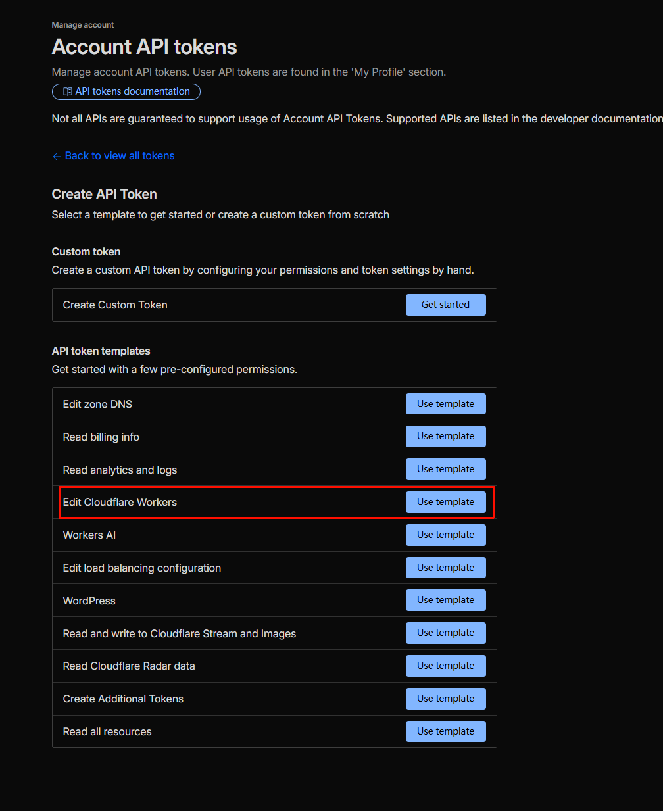
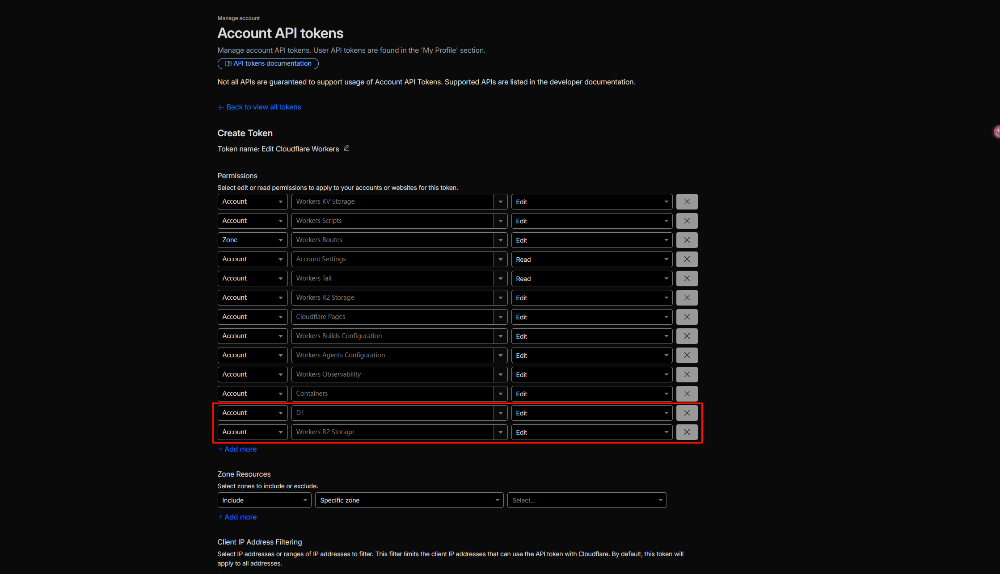

# 🚀 Cloudflare Workers 自动部署指南

本项目通过 GitHub Actions 实现了到 Cloudflare Workers 的全自动部署。只需一次性配置好相关的环境变量和密钥，后续提交代码即可全自动完成云端打包、D1 数据库初始化和 R2 存储桶创建等流程。

## 1. 获取 Cloudflare 凭据（必填）

在开始部署之前，您需要进入 Cloudflare 获取以下两个核心凭据，这负责授权 GitHub 帮您自动操作和部署您的云资源：

1. **`CLOUDFLARE_ACCOUNT_ID`** *(必填)*
   - 登录 Cloudflare 仪表板。
   - 在右侧边栏下方（或者 URL 中），找到您的 `Account ID` (账户 ID) 并复制。
2. **`CLOUDFLARE_API_TOKEN`** *(必填)*
   - 在 Cloudflare 仪表板右上角点击头像 -> 我的个人资料 (My Profile) -> API 令牌 (API Tokens)。
   - 点击“创建令牌 (Create Token)”，然后选择“编辑 Cloudflare Workers (Edit Cloudflare Workers)”模板。
   - 确保 `Account Resources` 设置为您的账户，`Zone Resources` 设置为 `All zones` 或对应授权的域。
   - **核心权限要求**: 请务必确保授权清单中包含对 `Workers Scripts`、`D1`、`R2` 以及 `Workers KV Storage` 的**编辑**权限。
   - 生成后，妥善保管该令牌。

   
   

## 2. 配置 GitHub 仓库 

前往您的 GitHub 仓库主页，点击顶部 `Settings` (设置) -> 在左侧边栏找到 `Secrets and variables` -> 选择 `Actions`。

### 🚨 核心必填项 (Repository Secrets)
以下两项是脚本运行的基础前提，**必须**存放在 `Secrets` 中：

| 变量名 | 说明 |
| --- | --- |
| **`CLOUDFLARE_ACCOUNT_ID`** | 您的 Cloudflare Account ID（来源见上文） |
| **`CLOUDFLARE_API_TOKEN`** | 您的 Cloudflare API 令牌（来源见上文） |

### ⚙️ 应用配置项 (Variables / Secrets)
以下参数用于构建应用配置，Action 执行时会尝试读取并覆盖代码默认值。**如果非必选的选项为空，则使用代码里 `wrangler.toml` 文件自带的默认配置。**
*(规则建议：需要保密的诸如 Password、Token 放入 `Secrets`；公开名称类的放入 `Variables`)*

| 变量名 | 状态 | 默认值 (如果未配置) | 作用说明 |
| --- | :-: | --- | --- |
| `MAIL_DOMAIN` | **核心必填** | （空）| 您绑定的自定义的接发邮件信箱根域名，**必填，否则无法收发邮件** |
| `ADMIN_PASSWORD`| **强烈建议** | 读取默认配置 | 管理员后台独立登录密码，**外网部署极其建议在 Secrets 配置以策安全** |
| `JWT_TOKEN` | **强烈建议** | 读取默认配置 | 用于签发身份票据的 JWT 密钥，请使用一段长且乱的复杂随机字符串 |
| `NAME` | 选填 | `mailfree` | 发布在云端 Cloudflare Worker 里的服务名称 |
| `D1_DB_NAME` | 选填 | `mail_free_db` | D1 数据库名字。部署时如果发现库不存在，脚本会自动新建 |
| `R2_BUCKET_NAME`| 选填 | `mail-eml` | R2 存储桶名字。部署时如果不存在，系统会自动新建 |
| `ADMIN_NAME` | 选填 | `admin` | 管理员后台的系统登录账户名 |
| `SESSION_EXPIRE_DAYS` | 选填 | `365` | 会话自动超时天数（登录后台后能保持多久） |
| `RESEND_API_KEY`| 选填 | （空） | 需要发信的若是使用 Resend 的 API Key 凭证 |
| `GUEST_PASSWORD`| 选填 | （空） | 如果开放访客阅读功能，为访客账号单独指定的阅读密码 |
| `JWT_TOKENGUEST_PASSWORD`| 选填 | （空） | 配合上面访客功能专门设立的额外凭据 |

## 3. 触发自动部署

当 `Secrets` 和 `Variables` 全部配制就位，您就可以让系统自动运行部署了：

1. **基于推送的自动化**: 从现在起，当您将任何更新代码（指代 `src/`、`public/` 内容或修改了 `wrangler.toml` 文件的提交）合入 `main` 分支时，都会自动开启部署流水线。
2. **手动开启强制部署**: 点击仓库上部的 `Actions` 选项卡，在左边流工作栏选中 `🚀 Deploy freemail to Cloudflare Workers`，之后点击右侧的 **Run workflow** 按钮启动部署流水线。

等待片刻，如果是看到 `✅ Deployment completed successfully!`，则说明部署已经圆满成功，并且构建过程底部还会输出您最终可以直接访问的网页端 Worker URL 连接！
